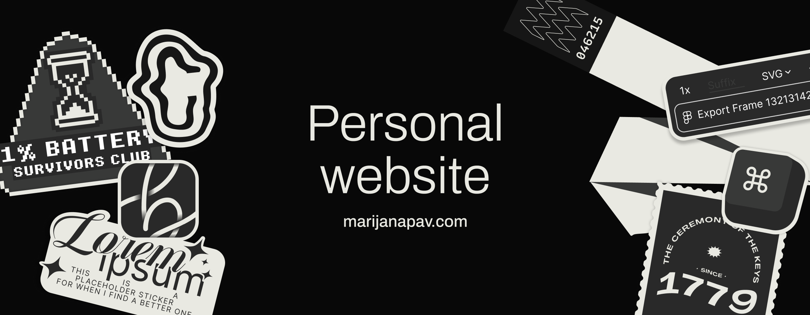

# marijanapav.com 
 
Part portfolio, part playground. An evolving space for my design work and ongoing experiments. 
Built together with my partner **@rpavlini**, without whom all of this would still live only in Figma :)

This site is forever changing. Expect frequent nitpick commits.

## marijanapav.com/stamps 

A side project where I reinterpret my grandfather’s stamp collection as a digital one.  
It’s part archive, part design study — my own small digital philately album, where I explore the blend of art, history, and typography and bringing it online for a new audience to enjoy.
[Visit website](https://marijanapav.com/stamps)

### Notes
Published October 2025.  
It’s intended as a small archive, a quiet homage, and a place to experiment. I add an occasional new stamp set when I find time to create more.

## marijanapav.com/sketchbook 
? WIP
A space for loose unformed ideas, early tests, and small visual explorations.

### Contact
**marijana@buka.studio**

