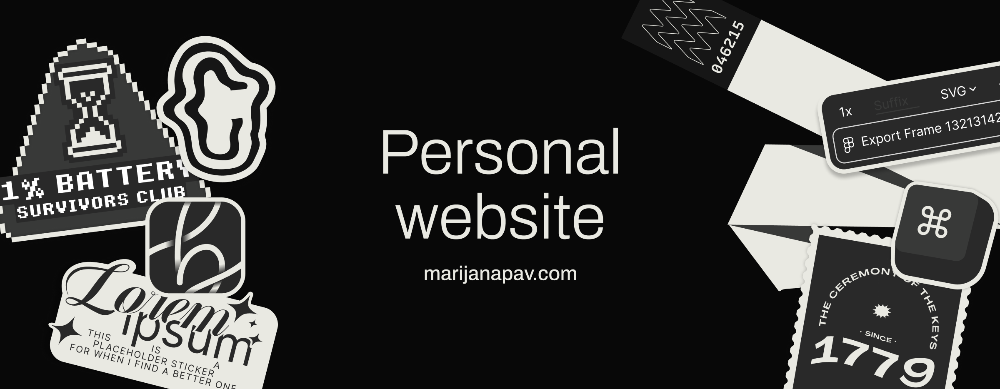
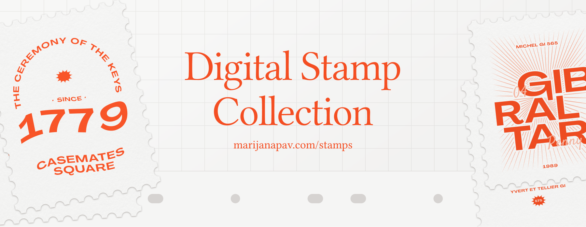

# marijanapav.com 
 
Part portfolio, part playground. An evolving space for my design work and ongoing experiments. 
Built together with my partner **@rpavlini**, without whom all of this would still live only in Figma :)

This site is forever changing. Expect frequent nitpick commits.



## marijanapav.com/stamps 

A side project where I reinterpret my grandfather’s stamp collection as a digital one.  
It’s part archive, part design study — my own small digital philately album, where I explore the blend of art, history, and typography and bringing it online for a new audience to enjoy.
[Visit website](https://marijanapav.com/stamps)


### Notes
Published October 2025.  
It’s intended as a small archive, a quiet homage, and a place to experiment. I add an occasional new stamp set when I find time to create more.

## marijanapav.com/sketchbook 
? WIP
A space for loose unformed ideas, early tests, and small visual explorations.

### Contact
**marijana@buka.studio**

## Deployment

This app deploys to Cloudflare Workers through Alchemy and OpenNext.

Alchemy provisions the Worker, D1 database, R2 sketch bucket, and Cloudflare Images binding. The
`IMAGES` binding is required for OpenNext/Cloudflare `next/image` optimization, so Cloudflare Images
must be enabled on the Cloudflare account before deploying.

Install the Cloudflare deployment dependencies after pulling migration changes:

```sh
npm install
```

Run the local Cloudflare dev environment:

```sh
npm run dev
```

Build and deploy:

```sh
npm run build
npm run deploy
```

## Database migrations

D1 schema changes are defined in `src/db/schema.ts` and generated with Drizzle Kit:

```sh
npm run db:generate
```

Apply migrations locally:

```sh
npm run db:migrate:local
```

Apply migrations to Cloudflare:

```sh
npm run db:migrate:remote
```
